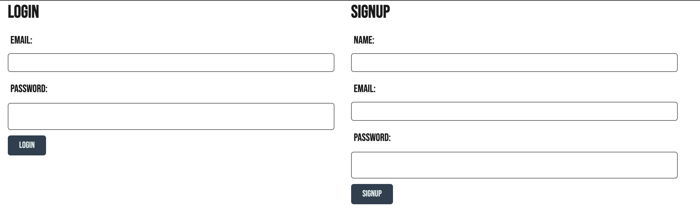
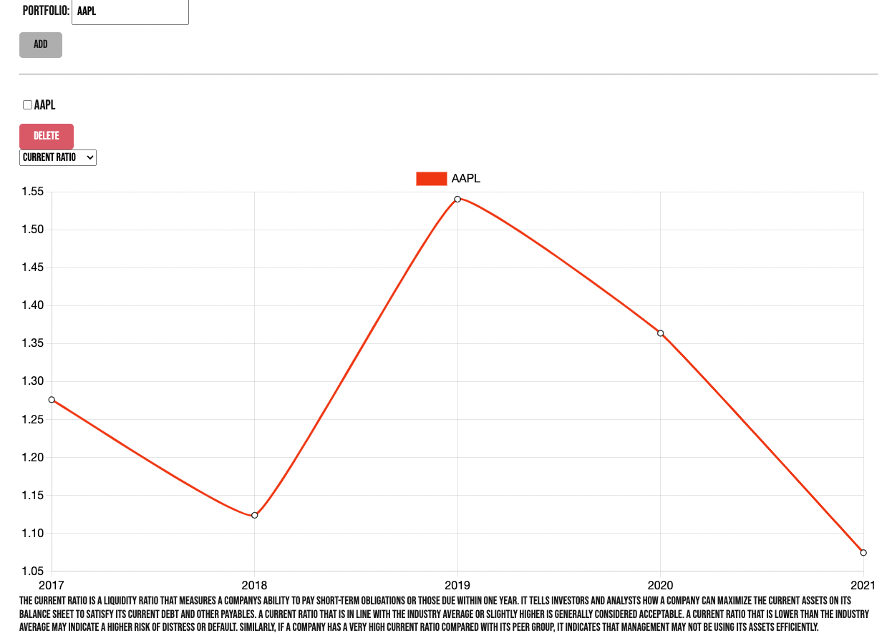
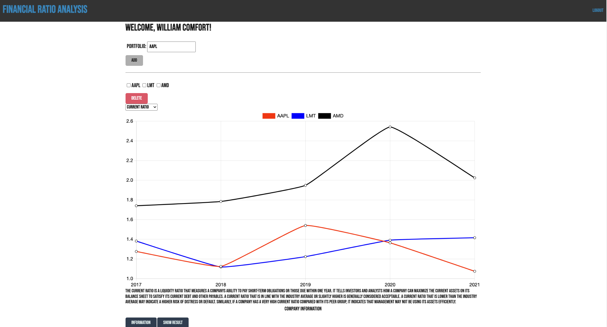

# Financial-Ratio-Analysis

## DESCRIPTION
In this application you will be able to search and compare companies over the past 5 years using their financial ratios so that you may create accurate financial decisions.

## INSTALLATION

See link to the deployed site.

Otherwise to run locally, after cloning the repository run the code below:

```
npm i
npm run seed
npm start

```

## USAGE

1) Sign-up or login by clicking the login button at the top right corner of site.


2) Fill in the the appropriate credentials then login or sign up.


3) You then will be directed to the back to the dashboard. Where you may select the ratio you would like to analyze from the dropdown menu, and the company you would like to plot by using the search.


4) Once a company is selected the plot with show the selected ratio and company trend over the past 5 years. Select another company to and more data to the plot -->


5) As you search for companies these will be added to you portfolio for quick use later and for further descriptions. To delete a company from your portfolio you may check the box and hit the delete button


## LINKS

https://fsa-ratio.herokuapp.com/

https://github.com/ebattani/Financial-Statement-Ratio-Analysis

## Contacts

Ethan Battani - https://github.com/ebattani
Nara Davaasuren - https://github.com/Nara1469
W. Brandon Comfort - https://github.com/Wbgc728
